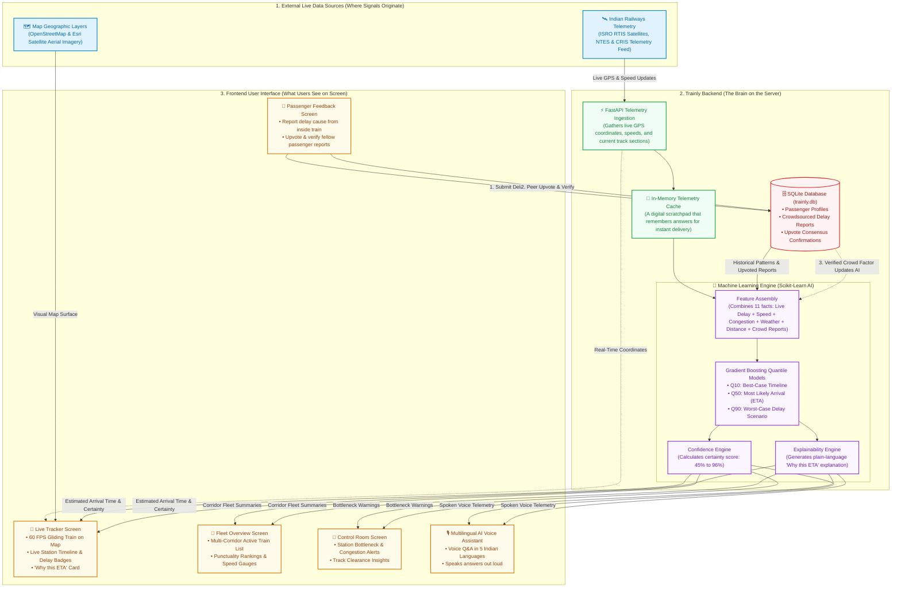

# Trainly — System Architecture & Flowchart

> **Who this document is for:** Hackathon judges, presentation audiences, and anyone who wants to see how information travels from a real locomotive to a passenger's smartphone.  
> **How to read this:** First, look at the visual flowchart diagram below. Right after it, read the **1-Minute Walkthrough Story** — a simple 6-step explanation you can read out loud to anyone.

---

## 1. Visual Architecture Flowchart

---

## 2. The 1-Minute Walkthrough (Read This Out Loud to Judges)

> *"Here is how Trainly works from locomotive to smartphone in 6 simple steps:"*

1. **The Signal Starts at the Train:** Every few seconds, our system receives live satellite GPS telemetry from the locomotive — telling us its exact location, speed (like 108 km/h), and which two stations it is traveling between.
2. **The Server Catches and Organizes It:** Our backend server (built with FastAPI) catches this information in milliseconds. It saves a quick copy in memory so we don't have to bombard the railway servers with duplicate questions.
3. **The Artificial Intelligence Predicts the Arrival:** Instead of just guessing based on distance, our machine learning model looks at **11 real-world factors** at once: how late the train currently is, whether delays usually snowball on this specific track section, time of day, weather, and reports from passengers on board.
4. **Three Scenarios and a Confidence Score:** The model calculates three possible futures: a best-case arrival (Q10), a realistic arrival (Q50), and a worst-case delay (Q90). When the gap between best and worst is narrow, we show a high confidence score (like **92%**); if the gap is wide, we honestly lower it (like **58%**).
5. **Instant Delivery to the Passenger's Screen:** This prediction, along with an English/Hindi plain-language explanation of *why* the delay is expected, flies across to your screen. The interactive map uses a smooth 60-frames-per-second animation so you can literally watch your train gliding forward along the railway line.
6. **The Crowd-Powered Feedback Loop:** If a train stops unexpectedly in the middle of nowhere, a passenger inside can tap the **Delay Feedback** screen to report the cause — like a red signal hold. When other passengers on board upvote that report, our database verifies it and feeds it straight back into the AI model, making predictions smarter for everyone waiting down the line.

---

## 3. What Happens on Each Major Screen

| Screen | What the User Actually Sees | Where the Data Came From |
| :--- | :--- | :--- |
| **📍 Live Tracker** | An interactive satellite or street map showing the train moving smoothly along real railway tracks, a station-by-station arrival timeline, and a "Why this ETA" card explaining the prediction. | Live GPS telemetry + ML Quantile prediction model + OpenStreetMap/Esri map tiles. |
| **🚆 Fleet Overview** | A high-level dashboard displaying multiple Indian Railways corridors side-by-side, ranked from most punctual to most delayed, with live speedometers. | Multi-train telemetry summaries polled every few seconds from the backend cache. |
| **🚨 Control Room** | A tactical operations view designed for railway controllers, highlighting track bottlenecks, high-congestion junction zones, and critical dispatch alerts. | Aggregated delay statistics and section saturation metrics from the database. |
| **🎙️ AI Voice Assistant** | A speech-enabled chatbot supporting 5 Indian languages (English, Hindi, Tamil, Telugu, Malayalam) that answers spoken questions about train positions and delays. | Browser Web Speech Recognition API paired with an offline phonetic matching algorithm. |
| **👥 Passenger Feedback** | A community board where passengers traveling on the train report delay causes (signal halt, mechanical issue, weather) and upvote/downvote fellow reports. | SQLite database with peer-consensus upvoting that feeds back into the AI engine. |
